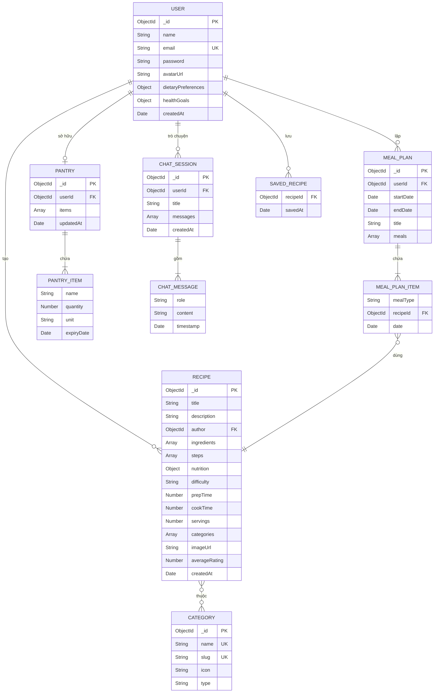
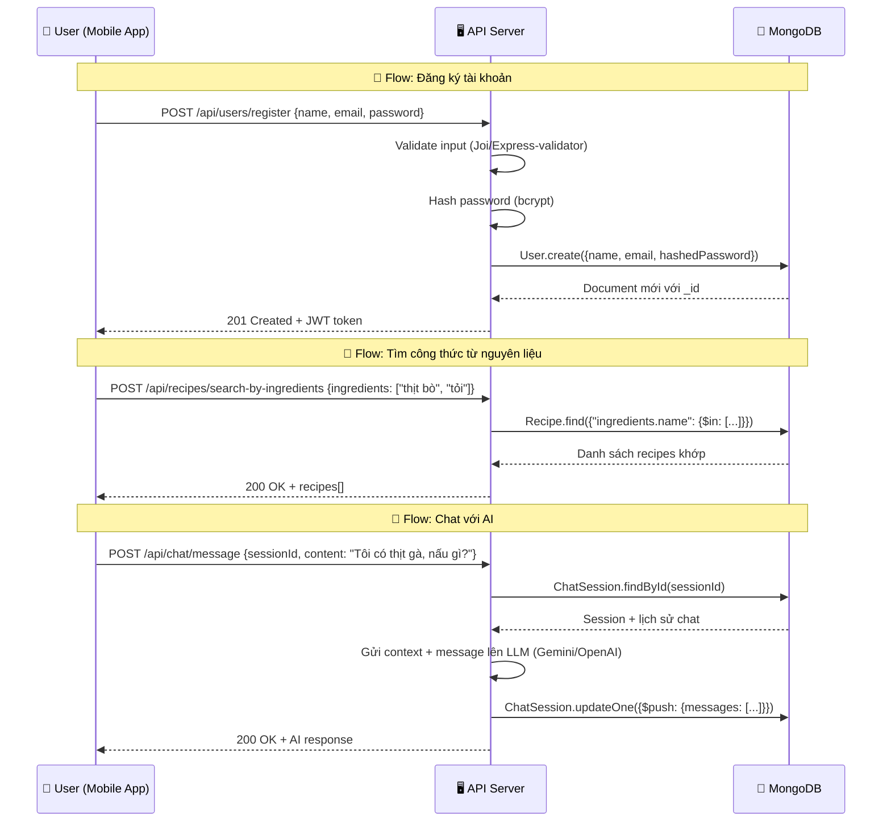

# 🍽️ Hướng Dẫn Thiết Kế Database Cho Eatsy

> [!NOTE]
> Tài liệu này được viết cho người **hoàn toàn chưa biết gì** về database design.
> Mình sẽ giải thích từ những khái niệm cơ bản nhất, rồi đi sâu vào thiết kế cụ thể cho Eatsy.

---

## 📚 Phần 1: Kiến Thức Cơ Bản

### 1.1 Database (Cơ sở dữ liệu) là gì?

Hãy tưởng tượng database giống như một **tủ hồ sơ khổng lồ** trong văn phòng:
- Mỗi **ngăn kéo** chứa một loại hồ sơ (ví dụ: ngăn "Người dùng", ngăn "Công thức")
- Mỗi **tờ hồ sơ** trong ngăn kéo là một bản ghi cụ thể (ví dụ: thông tin của user "Ngọc")
- Mỗi **ô thông tin** trên tờ hồ sơ là một trường dữ liệu (ví dụ: tên, email, mật khẩu)

### 1.2 MongoDB vs SQL — Tại sao Eatsy dùng MongoDB?

| Đặc điểm | SQL (MySQL, PostgreSQL) | MongoDB |
|-----------|------------------------|---------|
| Cấu trúc | Bảng cứng, cố định (giống bảng Excel) | Linh hoạt, dạng JSON |
| Thuật ngữ | Table → Row → Column | Collection → Document → Field |
| Phù hợp | Dữ liệu có cấu trúc chặt (ngân hàng) | Dữ liệu linh hoạt, thay đổi nhiều |
| Ví dụ | Bảng `users` với các cột cố định | Collection `users` chứa các document JSON |

**Tại sao Eatsy chọn MongoDB?**
- Công thức nấu ăn rất **đa dạng** — có món 3 bước, có món 20 bước, có món cần lò nướng, có món không
- Nguyên liệu **không cố định** — mỗi món có số lượng nguyên liệu khác nhau
- Dữ liệu AI chat **phi cấu trúc** — cuộc hội thoại dài ngắn khác nhau
- MongoDB lưu dữ liệu dạng **JSON** → rất quen thuộc với JavaScript developers

### 1.3 Mongoose là gì?

Mongoose là **thư viện trung gian** giữa code Node.js và MongoDB:

```
Code Node.js  →  Mongoose  →  MongoDB
(bạn viết)      (dịch giúp)   (lưu trữ)
```

Mongoose giúp bạn:
- **Định nghĩa Schema** (khuôn mẫu): "User phải có email, và email phải là dạng String"
- **Validate** (kiểm tra): "Email không được để trống, phải đúng format"
- **Tạo mối quan hệ**: "Công thức này thuộc về User nào?"

### 1.4 Các thuật ngữ quan trọng

| Thuật ngữ | Giải thích | Ví dụ Eatsy |
|-----------|------------|-------------|
| **Schema** | Bản vẽ/khuôn mẫu cho dữ liệu | "User gồm: tên, email, mật khẩu" |
| **Model** | Công cụ để tương tác với DB dựa trên Schema | `User.find()`, `User.create()` |
| **Document** | Một bản ghi cụ thể | `{ name: "Ngọc", email: "ngoc@gmail.com" }` |
| **Collection** | Tập hợp các Document cùng loại | Tất cả Users, tất cả Recipes |
| **Field** | Một trường thông tin | `name`, `email`, `password` |
| **ObjectId** | ID duy nhất MongoDB tự tạo | `507f1f77bcf86cd799439011` |
| **Ref (Reference)** | Tham chiếu/liên kết đến Document khác | Recipe có `author` trỏ đến User |
| **Embedded** | Nhúng dữ liệu con trực tiếp vào document cha | Nguyên liệu nhúng trong Recipe |
| **Index** | Chỉ mục giúp tìm kiếm nhanh hơn | Index trên `email` của User |

---

## 📐 Phần 2: Phân Tích Yêu Cầu Nghiệp Vụ

Từ README của Eatsy, mình xác định được các **thực thể** (entities) chính:

### 2.1 Ai/Cái gì cần lưu trữ?

| # | Thực thể | Mô tả | Module Backend |
|---|----------|--------|---------------|
| 1 | **User** | Người dùng ứng dụng | `user` |
| 2 | **Recipe** | Công thức nấu ăn | `recipe` |
| 3 | **Ingredient** | Nguyên liệu trong kho của user | `ingredient-engine` |
| 4 | **MealPlan** | Kế hoạch bữa ăn | `meal-planning` |
| 5 | **ChatSession** | Phiên trò chuyện với AI | `ai-assistant` |
| 6 | **Category** | Danh mục phân loại | `discovery` |

### 2.2 Chúng liên quan đến nhau thế nào?

- Một **User** có thể tạo nhiều **Recipe** (1 → nhiều)
- Một **User** có một **Ingredient Pantry** (tủ nguyên liệu) (1 → 1)
- Một **User** có nhiều **MealPlan** (1 → nhiều)
- Một **User** có nhiều **ChatSession** với AI (1 → nhiều)
- Một **Recipe** thuộc nhiều **Category** (nhiều → nhiều)
- Một **MealPlan** chứa nhiều **Recipe** (nhiều → nhiều)

---

## 🗺️ Phần 3: Sơ Đồ Quan Hệ Thực Thể (ERD)



> [!TIP]
> **Cách đọc sơ đồ ERD:**
> - `||--o{` = "một → nhiều" (một User tạo nhiều Recipe)
> - `||--o|` = "một → một" (một User có một Pantry)
> - `}o--o{` = "nhiều → nhiều" (Recipe thuộc nhiều Category)
> - `PK` = Primary Key (khóa chính, ID duy nhất)
> - `FK` = Foreign Key (khóa ngoại, tham chiếu đến bảng khác)
> - `UK` = Unique Key (giá trị không được trùng)

---

## 🏗️ Phần 4: Thiết Kế Chi Tiết Từng Model

### 4.1 User Model — `user.model.js`

**Lưu trữ gì?** Thông tin người dùng, tùy chọn ăn uống, mục tiêu sức khỏe.

```javascript
import mongoose from "mongoose";

// ═══════════════════════════════════════════════
// 📋 USER SCHEMA — Thông tin người dùng
// ═══════════════════════════════════════════════

const userSchema = new mongoose.Schema(
  {
    // --- Thông tin cơ bản ---
    name: {
      type: String,
      required: [true, "Tên không được để trống"], // bắt buộc + lỗi tùy chỉnh
      trim: true, // tự động xóa khoảng trắng thừa
      minlength: [2, "Tên phải có ít nhất 2 ký tự"],
      maxlength: [50, "Tên không được quá 50 ký tự"],
    },

    email: {
      type: String,
      required: [true, "Email không được để trống"],
      unique: true, // không cho phép 2 user cùng email
      lowercase: true, // tự động chuyển thành chữ thường
      trim: true,
      match: [/^\S+@\S+\.\S+$/, "Email không hợp lệ"], // regex kiểm tra format
    },

    password: {
      type: String,
      required: [true, "Mật khẩu không được để trống"],
      minlength: [6, "Mật khẩu phải có ít nhất 6 ký tự"],
      select: false, // ⚠️ QUAN TRỌNG: mặc định KHÔNG trả password khi query
    },

    avatarUrl: {
      type: String,
      default: "", // ảnh đại diện, mặc định rỗng
    },

    // --- Tùy chọn ăn uống (cá nhân hóa AI) ---
    dietaryPreferences: {
      // Chế độ ăn: "omnivore" | "vegetarian" | "vegan" | "pescatarian" | "keto" | "paleo"
      dietType: {
        type: String,
        enum: ["omnivore", "vegetarian", "vegan", "pescatarian", "keto", "paleo"],
        default: "omnivore",
      },
      // Dị ứng: ["đậu phộng", "hải sản", "lactose", ...]
      allergies: {
        type: [String],
        default: [],
      },
      // Không thích ăn: ["hành", "mùi", ...]
      dislikedIngredients: {
        type: [String],
        default: [],
      },
      // Ẩm thực yêu thích: ["Việt Nam", "Nhật Bản", "Ý", ...]
      cuisinePreferences: {
        type: [String],
        default: [],
      },
    },

    // --- Mục tiêu sức khỏe ---
    healthGoals: {
      // Mục tiêu: "maintain" | "lose_weight" | "gain_muscle" | "eat_healthier"
      goal: {
        type: String,
        enum: ["maintain", "lose_weight", "gain_muscle", "eat_healthier"],
        default: "maintain",
      },
      // Lượng calo mục tiêu mỗi ngày
      dailyCalorieTarget: {
        type: Number,
        default: 2000,
        min: [800, "Lượng calo tối thiểu là 800"],
        max: [5000, "Lượng calo tối đa là 5000"],
      },
    },

    // --- Công thức đã lưu (bookmark) ---
    savedRecipes: [
      {
        recipeId: {
          type: mongoose.Schema.Types.ObjectId,
          ref: "Recipe", // tham chiếu đến collection Recipe
        },
        savedAt: {
          type: Date,
          default: Date.now,
        },
      },
    ],

    // --- Trạng thái tài khoản ---
    isActive: {
      type: Boolean,
      default: true,
    },
  },
  {
    // Tùy chọn Schema
    timestamps: true, // tự động tạo createdAt & updatedAt
    toJSON: { virtuals: true }, // khi chuyển sang JSON, include virtuals
    toObject: { virtuals: true },
  }
);

// ═══════════════════════════════════════════════
// 📇 INDEXES — Chỉ mục giúp tìm kiếm nhanh
// ═══════════════════════════════════════════════
userSchema.index({ email: 1 }); // tìm user theo email cực nhanh

// ═══════════════════════════════════════════════
// 🔧 VIRTUALS — Trường ảo, không lưu trong DB
// ═══════════════════════════════════════════════
// Tạo trường ảo "recipes" — lấy tất cả recipes của user này
userSchema.virtual("recipes", {
  ref: "Recipe",
  localField: "_id",
  foreignField: "author",
});

// ═══════════════════════════════════════════════
// 📤 EXPORT MODEL
// ═══════════════════════════════════════════════
const User = mongoose.model("User", userSchema);
export default User;
```

> [!IMPORTANT]
> **Tại sao `password` có `select: false`?**
> Khi bạn query `User.find()`, password sẽ **không** được trả về. Điều này ngăn chặn việc vô tình gửi password ra API. Khi cần kiểm tra password (lúc login), bạn phải dùng `User.findById(id).select("+password")`.

---

### 4.2 Recipe Model — `recipe.model.js`

**Lưu trữ gì?** Công thức nấu ăn với nguyên liệu, bước làm, dinh dưỡng.

```javascript
import mongoose from "mongoose";

// ═══════════════════════════════════════════════
// 📋 RECIPE SCHEMA — Công thức nấu ăn
// ═══════════════════════════════════════════════

// Sub-schema cho nguyên liệu (nhúng trong Recipe)
const ingredientSchema = new mongoose.Schema(
  {
    name: { type: String, required: true },      // Tên: "Thịt bò"
    quantity: { type: Number, required: true },   // Số lượng: 500
    unit: { type: String, required: true },       // Đơn vị: "gram"
    isOptional: { type: Boolean, default: false }, // Có tùy chọn không?
  },
  { _id: false } // không tạo _id cho sub-document
);

// Sub-schema cho bước nấu
const stepSchema = new mongoose.Schema(
  {
    order: { type: Number, required: true },       // Thứ tự: 1, 2, 3...
    instruction: { type: String, required: true }, // Hướng dẫn
    duration: { type: Number },                    // Thời gian (phút)
    imageUrl: { type: String },                    // Ảnh minh họa (optional)
  },
  { _id: false }
);

// Sub-schema cho đánh giá
const reviewSchema = new mongoose.Schema(
  {
    userId: {
      type: mongoose.Schema.Types.ObjectId,
      ref: "User",
      required: true,
    },
    rating: {
      type: Number,
      required: true,
      min: 1,
      max: 5,
    },
    comment: { type: String, maxlength: 500 },
    createdAt: { type: Date, default: Date.now },
  },
  { _id: true }
);

// Schema chính cho Recipe
const recipeSchema = new mongoose.Schema(
  {
    // --- Thông tin cơ bản ---
    title: {
      type: String,
      required: [true, "Tên món ăn không được để trống"],
      trim: true,
      maxlength: [100, "Tên món ăn không quá 100 ký tự"],
    },

    description: {
      type: String,
      required: [true, "Mô tả không được để trống"],
      maxlength: [1000, "Mô tả không quá 1000 ký tự"],
    },

    // Ai tạo công thức này?
    author: {
      type: mongoose.Schema.Types.ObjectId,
      ref: "User", // liên kết đến User
      required: true,
    },

    // --- Nội dung chính ---
    ingredients: {
      type: [ingredientSchema], // mảng nguyên liệu (nhúng)
      validate: {
        validator: (v) => v.length > 0,
        message: "Phải có ít nhất 1 nguyên liệu",
      },
    },

    steps: {
      type: [stepSchema], // mảng bước nấu (nhúng)
      validate: {
        validator: (v) => v.length > 0,
        message: "Phải có ít nhất 1 bước thực hiện",
      },
    },

    // --- Phân loại ---
    categories: [
      {
        type: mongoose.Schema.Types.ObjectId,
        ref: "Category", // liên kết đến Category
      },
    ],

    difficulty: {
      type: String,
      enum: ["easy", "medium", "hard"],
      default: "medium",
    },

    // Loại bữa ăn
    mealType: {
      type: [String],
      enum: ["breakfast", "lunch", "dinner", "snack", "dessert"],
      default: ["lunch"],
    },

    // --- Thời gian ---
    prepTime: { type: Number, required: true, min: 0 },   // Thời gian chuẩn bị (phút)
    cookTime: { type: Number, required: true, min: 0 },   // Thời gian nấu (phút)
    servings: { type: Number, required: true, min: 1 },   // Số phần ăn

    // --- Dinh dưỡng (trên 1 phần ăn) ---
    nutrition: {
      calories: { type: Number, default: 0 },        // Calo
      protein: { type: Number, default: 0 },          // Protein (g)
      carbohydrates: { type: Number, default: 0 },    // Carb (g)
      fat: { type: Number, default: 0 },              // Chất béo (g)
      fiber: { type: Number, default: 0 },            // Chất xơ (g)
    },

    // --- Hình ảnh ---
    imageUrl: {
      type: String,
      default: "",
    },

    // --- Đánh giá ---
    reviews: [reviewSchema],
    averageRating: { type: Number, default: 0, min: 0, max: 5 },
    totalReviews: { type: Number, default: 0 },

    // --- Trạng thái ---
    isPublished: { type: Boolean, default: true },

    // Tags tìm kiếm
    tags: {
      type: [String],
      default: [],
    },
  },
  {
    timestamps: true,
    toJSON: { virtuals: true },
    toObject: { virtuals: true },
  }
);

// ═══════════════════════════════════════════════
// 📇 INDEXES
// ═══════════════════════════════════════════════
recipeSchema.index({ title: "text", description: "text", tags: "text" }); // Full-text search
recipeSchema.index({ author: 1 });
recipeSchema.index({ categories: 1 });
recipeSchema.index({ difficulty: 1 });
recipeSchema.index({ averageRating: -1 }); // sắp xếp giảm dần
recipeSchema.index({ "ingredients.name": 1 }); // tìm theo tên nguyên liệu

// ═══════════════════════════════════════════════
// 🔧 VIRTUAL — Tổng thời gian nấu
// ═══════════════════════════════════════════════
recipeSchema.virtual("totalTime").get(function () {
  return this.prepTime + this.cookTime;
});

// ═══════════════════════════════════════════════
// 📤 EXPORT MODEL
// ═══════════════════════════════════════════════
const Recipe = mongoose.model("Recipe", recipeSchema);
export default Recipe;
```

> [!TIP]
> **Embedding vs Referencing — Khi nào nhúng, khi nào tham chiếu?**
>
> | Chiến lược | Khi nào dùng | Ví dụ trong Eatsy |
> |-----------|------------|-------------------|
> | **Embed** (nhúng) | Dữ liệu con luôn đi kèm cha, ít thay đổi | `ingredients` nhúng trong `Recipe` |
> | **Reference** (tham chiếu) | Dữ liệu con độc lập, dùng ở nhiều nơi | `author` tham chiếu đến `User` |
>
> → Nguyên liệu của một recipe **luôn đi cùng** recipe đó → **Embed**
> → User tạo nhiều recipe, và user tồn tại độc lập → **Reference**

---

### 4.3 Ingredient Engine Model — `ingredient-engine.model.js`

**Lưu trữ gì?** "Tủ lạnh" của user — nguyên liệu đang có sẵn.

```javascript
import mongoose from "mongoose";

// ═══════════════════════════════════════════════
// 📋 PANTRY SCHEMA — Tủ nguyên liệu của user
// ═══════════════════════════════════════════════

// Sub-schema cho từng item trong tủ
const pantryItemSchema = new mongoose.Schema(
  {
    name: {
      type: String,
      required: [true, "Tên nguyên liệu không được để trống"],
      trim: true,
    },
    quantity: {
      type: Number,
      required: true,
      min: [0, "Số lượng không thể âm"],
    },
    unit: {
      type: String,
      required: true,
      enum: ["gram", "kg", "ml", "liter", "piece", "tbsp", "tsp", "cup"],
    },
    category: {
      type: String,
      enum: [
        "vegetable",   // Rau củ
        "fruit",       // Trái cây
        "meat",        // Thịt
        "seafood",     // Hải sản
        "dairy",       // Sữa/bơ/phô mai
        "grain",       // Ngũ cốc
        "spice",       // Gia vị
        "sauce",       // Nước sốt
        "other",       // Khác
      ],
      default: "other",
    },
    expiryDate: {
      type: Date, // Ngày hết hạn — giúp giảm lãng phí thức ăn!
    },
    addedAt: {
      type: Date,
      default: Date.now,
    },
  },
  { _id: true } // mỗi item có ID riêng để dễ xóa/sửa
);

// Schema chính — Pantry (Tủ lạnh)
const pantrySchema = new mongoose.Schema(
  {
    userId: {
      type: mongoose.Schema.Types.ObjectId,
      ref: "User",
      required: true,
      unique: true, // mỗi user chỉ có 1 pantry
    },
    items: [pantryItemSchema], // danh sách nguyên liệu
  },
  {
    timestamps: true,
  }
);

// ═══════════════════════════════════════════════
// 📇 INDEXES
// ═══════════════════════════════════════════════
pantrySchema.index({ userId: 1 });
pantrySchema.index({ "items.name": 1 }); // tìm nguyên liệu theo tên
pantrySchema.index({ "items.expiryDate": 1 }); // tìm nguyên liệu sắp hết hạn

// ═══════════════════════════════════════════════
// 📤 EXPORT MODEL
// ═══════════════════════════════════════════════
const Pantry = mongoose.model("Pantry", pantrySchema);
export default Pantry;
```

> [!IMPORTANT]
> **Tại sao tách Pantry ra khỏi User?**
> Nếu nhúng `items[]` vào User document, khi user có 100+ nguyên liệu → document quá lớn → query chậm. Tách ra giúp:
> 1. User document nhẹ nhàng
> 2. Query pantry riêng khi cần
> 3. Dễ phân quyền API

---

### 4.4 Meal Planning Model — `meal-planning.model.js`

**Lưu trữ gì?** Kế hoạch bữa ăn theo ngày/tuần.

```javascript
import mongoose from "mongoose";

// ═══════════════════════════════════════════════
// 📋 MEAL PLAN SCHEMA — Kế hoạch bữa ăn
// ═══════════════════════════════════════════════

// Sub-schema cho từng bữa ăn trong kế hoạch
const mealItemSchema = new mongoose.Schema(
  {
    date: {
      type: Date,
      required: [true, "Ngày không được để trống"],
    },
    mealType: {
      type: String,
      enum: ["breakfast", "lunch", "dinner", "snack"],
      required: true,
    },
    recipeId: {
      type: mongoose.Schema.Types.ObjectId,
      ref: "Recipe", // liên kết đến công thức
      required: true,
    },
    servings: {
      type: Number,
      default: 1,
      min: 1,
    },
    isCompleted: {
      type: Boolean,
      default: false, // đã nấu chưa?
    },
    notes: {
      type: String,
      maxlength: 200, // ghi chú thêm
    },
  },
  { _id: true }
);

// Schema chính — MealPlan
const mealPlanSchema = new mongoose.Schema(
  {
    userId: {
      type: mongoose.Schema.Types.ObjectId,
      ref: "User",
      required: true,
    },
    title: {
      type: String,
      default: "Kế hoạch bữa ăn",
      maxlength: 100,
    },
    startDate: {
      type: Date,
      required: [true, "Ngày bắt đầu không được để trống"],
    },
    endDate: {
      type: Date,
      required: [true, "Ngày kết thúc không được để trống"],
    },
    meals: [mealItemSchema], // danh sách bữa ăn

    // Thống kê dinh dưỡng tổng (optional, có thể tính từ recipes)
    totalNutrition: {
      calories: { type: Number, default: 0 },
      protein: { type: Number, default: 0 },
      carbohydrates: { type: Number, default: 0 },
      fat: { type: Number, default: 0 },
    },

    isActive: {
      type: Boolean,
      default: true,
    },
  },
  {
    timestamps: true,
  }
);

// ═══════════════════════════════════════════════
// 📇 INDEXES
// ═══════════════════════════════════════════════
mealPlanSchema.index({ userId: 1 });
mealPlanSchema.index({ startDate: 1, endDate: 1 });
mealPlanSchema.index({ userId: 1, isActive: 1 });

// ═══════════════════════════════════════════════
// 📤 EXPORT MODEL
// ═══════════════════════════════════════════════
const MealPlan = mongoose.model("MealPlan", mealPlanSchema);
export default MealPlan;
```

---

### 4.5 AI Assistant Model — `ai-assistant.model.js`

**Lưu trữ gì?** Lịch sử trò chuyện giữa user và AI.

```javascript
import mongoose from "mongoose";

// ═══════════════════════════════════════════════
// 📋 CHAT SESSION SCHEMA — Phiên trò chuyện AI
// ═══════════════════════════════════════════════

// Sub-schema cho từng tin nhắn
const messageSchema = new mongoose.Schema(
  {
    role: {
      type: String,
      enum: ["user", "assistant", "system"],
      // user = người dùng gửi
      // assistant = AI trả lời
      // system = hướng dẫn hệ thống (ẩn với user)
      required: true,
    },
    content: {
      type: String,
      required: [true, "Nội dung tin nhắn không được để trống"],
    },
    // Nếu AI gợi ý recipe nào
    relatedRecipes: [
      {
        type: mongoose.Schema.Types.ObjectId,
        ref: "Recipe",
      },
    ],
    timestamp: {
      type: Date,
      default: Date.now,
    },
  },
  { _id: true }
);

// Schema chính — ChatSession
const chatSessionSchema = new mongoose.Schema(
  {
    userId: {
      type: mongoose.Schema.Types.ObjectId,
      ref: "User",
      required: true,
    },
    title: {
      type: String,
      default: "Cuộc trò chuyện mới",
      maxlength: 100,
    },
    messages: [messageSchema], // mảng tin nhắn

    // Ngữ cảnh AI — lưu lại context để AI "nhớ" cuộc hội thoại
    context: {
      // AI đang giúp về chủ đề gì?
      topic: {
        type: String,
        enum: [
          "recipe_suggestion",    // Gợi ý công thức
          "cooking_help",         // Hỗ trợ nấu ăn
          "ingredient_substitute", // Thay thế nguyên liệu
          "meal_planning",        // Lập kế hoạch
          "nutrition_advice",     // Tư vấn dinh dưỡng
          "general",              // Chung
        ],
        default: "general",
      },
    },

    isActive: {
      type: Boolean,
      default: true,
    },
  },
  {
    timestamps: true,
  }
);

// ═══════════════════════════════════════════════
// 📇 INDEXES
// ═══════════════════════════════════════════════
chatSessionSchema.index({ userId: 1 });
chatSessionSchema.index({ userId: 1, isActive: 1 });
chatSessionSchema.index({ createdAt: -1 }); // mới nhất trước

// ═══════════════════════════════════════════════
// 📤 EXPORT MODEL
// ═══════════════════════════════════════════════
const ChatSession = mongoose.model("ChatSession", chatSessionSchema);
export default ChatSession;
```

---

### 4.6 Discovery/Category Model — `discovery.model.js`

**Lưu trữ gì?** Danh mục phân loại công thức (bữa sáng, bữa trưa, ẩm thực Việt, ...).

```javascript
import mongoose from "mongoose";

// ═══════════════════════════════════════════════
// 📋 CATEGORY SCHEMA — Danh mục phân loại
// ═══════════════════════════════════════════════

const categorySchema = new mongoose.Schema(
  {
    name: {
      type: String,
      required: [true, "Tên danh mục không được để trống"],
      unique: true,
      trim: true,
      maxlength: 50,
    },
    slug: {
      type: String,
      unique: true,
      lowercase: true,
      // "Ẩm thực Việt Nam" → "am-thuc-viet-nam"
    },
    description: {
      type: String,
      maxlength: 200,
    },
    icon: {
      type: String, // Emoji hoặc icon name: "🍜" hoặc "noodle"
      default: "🍽️",
    },
    imageUrl: {
      type: String,
      default: "",
    },
    type: {
      type: String,
      enum: [
        "meal_type",   // Loại bữa ăn: sáng, trưa, tối
        "cuisine",     // Ẩm thực: Việt, Nhật, Ý
        "diet",        // Chế độ ăn: chay, keto
        "occasion",    // Dịp: Tết, sinh nhật
        "cooking_method", // Phương pháp: nướng, hấp, chiên
      ],
      required: true,
    },
    sortOrder: {
      type: Number,
      default: 0, // thứ tự hiển thị
    },
    isActive: {
      type: Boolean,
      default: true,
    },
  },
  {
    timestamps: true,
  }
);

// ═══════════════════════════════════════════════
// 📇 INDEXES
// ═══════════════════════════════════════════════
categorySchema.index({ type: 1 });
categorySchema.index({ slug: 1 });
categorySchema.index({ sortOrder: 1 });

// ═══════════════════════════════════════════════
// 🔧 MIDDLEWARE — Tự động tạo slug từ name
// ═══════════════════════════════════════════════
categorySchema.pre("save", function (next) {
  if (this.isModified("name")) {
    this.slug = this.name
      .toLowerCase()
      .normalize("NFD") // xử lý tiếng Việt
      .replace(/[\u0300-\u036f]/g, "") // xóa dấu
      .replace(/đ/g, "d")
      .replace(/Đ/g, "D")
      .replace(/[^a-z0-9]+/g, "-") // thay ký tự đặc biệt bằng dấu gạch
      .replace(/^-+|-+$/g, ""); // xóa dấu gạch ở đầu/cuối
  }
  next();
});

// ═══════════════════════════════════════════════
// 📤 EXPORT MODEL
// ═══════════════════════════════════════════════
const Category = mongoose.model("Category", categorySchema);
export default Category;
```

---

## 🎯 Phần 5: Best Practices (Thực Hành Tốt)

### 5.1 Quy tắc vàng khi thiết kế MongoDB

| # | Quy tắc | Giải thích |
|---|---------|------------|
| 1 | **Thiết kế theo cách ứng dụng dùng dữ liệu** | Khác với SQL, MongoDB ưu tiên hiệu suất đọc. Nếu bạn luôn cần nguyên liệu cùng recipe → embed |
| 2 | **Document không quá 16MB** | Giới hạn của MongoDB. Đừng nhúng quá nhiều thứ vào 1 document |
| 3 | **Index những field thường query** | `email` tìm thường xuyên → cần index. `avatarUrl` ít tìm → không cần |
| 4 | **Dùng `select: false` cho data nhạy cảm** | Password, token, ... không nên trả về mặc định |
| 5 | **Validate ở cả Schema lẫn API** | Schema validate là "hàng rào cuối", API validate là "hàng rào đầu" |
| 6 | **Dùng `timestamps: true`** | Luôn biết document tạo/sửa lúc nào, rất hữu ích |

### 5.2 Flow dữ liệu thực tế



---

## 📝 Phần 6: Tóm Tắt & Bước Tiếp Theo

### Tổng kết các Collection

| Collection | Model | Mục đích |
|-----------|-------|----------|
| `users` | User | Thông tin tài khoản & tùy chọn cá nhân |
| `recipes` | Recipe | Công thức nấu ăn (nguyên liệu, bước, dinh dưỡng) |
| `pantries` | Pantry | Tủ nguyên liệu của user |
| `mealplans` | MealPlan | Kế hoạch bữa ăn theo ngày/tuần |
| `chatsessions` | ChatSession | Lịch sử chat với AI |
| `categories` | Category | Danh mục phân loại |

### Bước tiếp theo

1. ✅ **Copy code vào các file model** (hoặc để mình tự động tạo)
2. 🔒 Viết **authentication middleware** (JWT + bcrypt)
3. 📝 Viết **validation** cho mỗi module (Joi hoặc express-validator)
4. 🛣️ Thiết kế **API routes** cho từng module
5. 🧪 Test với **Postman** hoặc **Thunder Client**

> [!WARNING]
> **Bạn cần tạo MongoDB Atlas (miễn phí) trước khi chạy:**
> 1. Vào [mongodb.com/atlas](https://www.mongodb.com/atlas) → Tạo tài khoản
> 2. Tạo Cluster miễn phí (chọn M0 Free Tier)
> 3. Lấy connection string → Bỏ vào `.env` file: `MONGO_URI=mongodb+srv://...`
