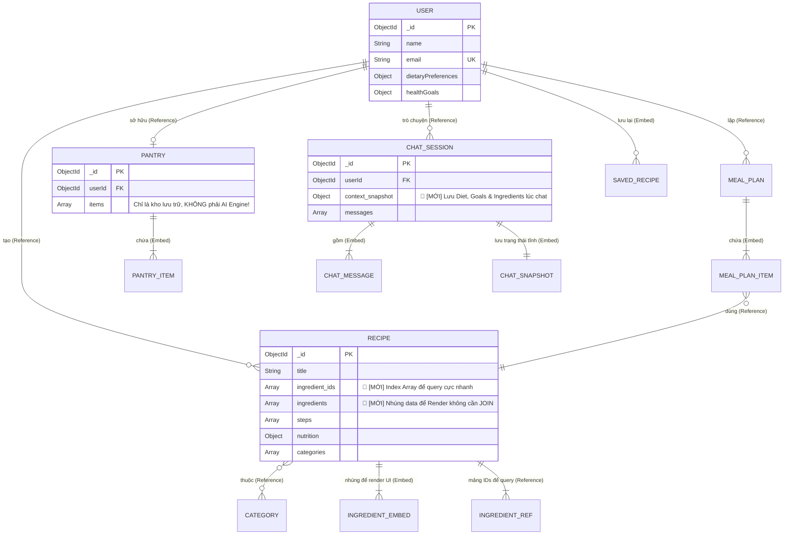
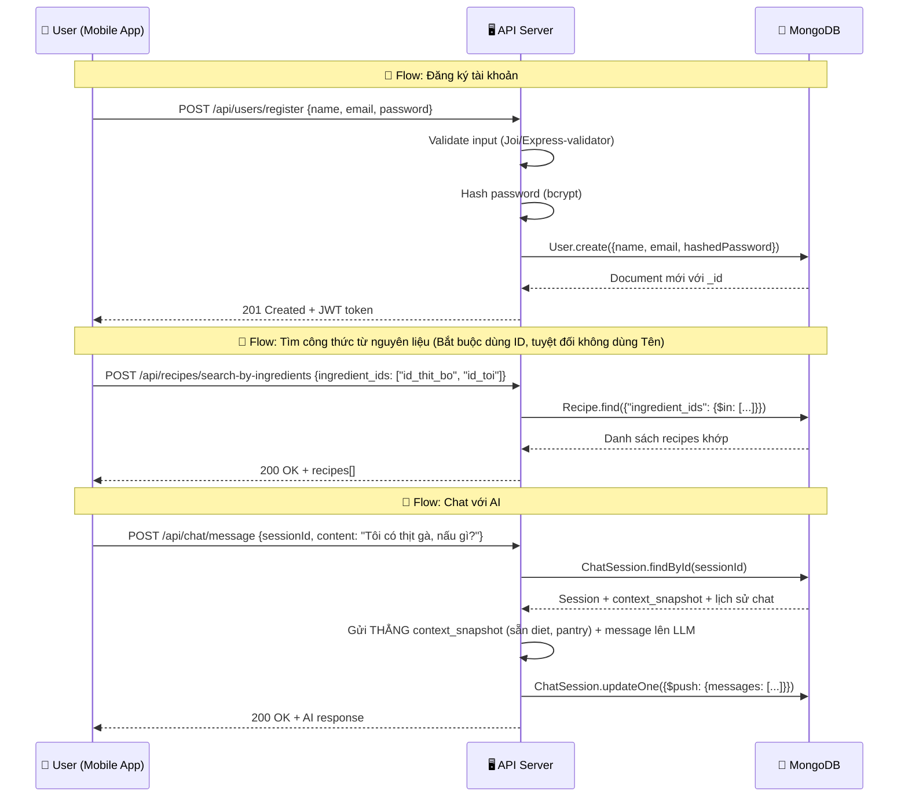

# 🍽️ Hướng Dẫn Thiết Kế Database Cho Eatsy

> [!NOTE]
> Tài liệu này được viết cho người **hoàn toàn chưa biết gì** về database design.
> Mình sẽ giải thích từ những khái niệm cơ bản nhất, rồi đi sâu vào thiết kế cụ thể cho Eatsy.

---

## 📚 Phần 1: Kiến Thức Cơ Bản

### 1.1 Database (Cơ sở dữ liệu) là gì?

Hãy tưởng tượng database giống như một **tủ hồ sơ khổng lồ** trong văn phòng:
- Mỗi **ngăn kéo** chứa một loại hồ sơ (ví dụ: ngăn "Người dùng", ngăn "Công thức")
- Mỗi **tờ hồ sơ** trong ngăn kéo là một bản ghi cụ thể (ví dụ: thông tin của user "Ngọc")
- Mỗi **ô thông tin** trên tờ hồ sơ là một trường dữ liệu (ví dụ: tên, email, mật khẩu)

### 1.2 MongoDB vs SQL — Tại sao Eatsy dùng MongoDB?

| Đặc điểm | SQL (MySQL, PostgreSQL) | MongoDB |
|-----------|------------------------|---------|
| Cấu trúc | Bảng cứng, cố định (giống bảng Excel) | Linh hoạt, dạng JSON |
| Thuật ngữ | Table → Row → Column | Collection → Document → Field |
| Phù hợp | Dữ liệu có cấu trúc chặt (ngân hàng) | Dữ liệu linh hoạt, thay đổi nhiều |
| Ví dụ | Bảng `users` với các cột cố định | Collection `users` chứa các document JSON |

**Tại sao Eatsy chọn MongoDB?**
- Công thức nấu ăn rất **đa dạng** — có món 3 bước, có món 20 bước, có món cần lò nướng, có món không
- Nguyên liệu **không cố định** — mỗi món có số lượng nguyên liệu khác nhau
- Dữ liệu AI chat **phi cấu trúc** — cuộc hội thoại dài ngắn khác nhau
- MongoDB lưu dữ liệu dạng **JSON** → rất quen thuộc với JavaScript developers

### 1.3 Mongoose là gì?

Mongoose là **thư viện trung gian** giữa code Node.js và MongoDB:

```
Code Node.js  →  Mongoose  →  MongoDB
(bạn viết)      (dịch giúp)   (lưu trữ)
```

Mongoose giúp bạn:
- **Định nghĩa Schema** (khuôn mẫu): "User phải có email, và email phải là dạng String"
- **Validate** (kiểm tra): "Email không được để trống, phải đúng format"
- **Tạo mối quan hệ**: "Công thức này thuộc về User nào?"

### 1.4 Các thuật ngữ quan trọng

| Thuật ngữ | Giải thích | Ví dụ Eatsy |
|-----------|------------|-------------|
| **Schema** | Bản vẽ/khuôn mẫu cho dữ liệu | "User gồm: tên, email, mật khẩu" |
| **Model** | Công cụ để tương tác với DB dựa trên Schema | `User.find()`, `User.create()` |
| **Document** | Một bản ghi cụ thể | `{ name: "Ngọc", email: "ngoc@gmail.com" }` |
| **Collection** | Tập hợp các Document cùng loại | Tất cả Users, tất cả Recipes |
| **Field** | Một trường thông tin | `name`, `email`, `password` |
| **ObjectId** | ID duy nhất MongoDB tự tạo | `507f1f77bcf86cd799439011` |
| **Ref (Reference)** | Tham chiếu/liên kết đến Document khác | Recipe có `author` trỏ đến User |
| **Embedded** | Nhúng dữ liệu con trực tiếp vào document cha | Nguyên liệu nhúng trong Recipe |
| **Index** | Chỉ mục giúp tìm kiếm nhanh hơn | Index trên `email` của User |

---

## 📐 Phần 2: Phân Tích Yêu Cầu Nghiệp Vụ

Từ README của Eatsy, mình xác định được các **thực thể** (entities) chính:

### 2.1 Ai/Cái gì cần lưu trữ?

| # | Thực thể | Mô tả | Module Backend |
|---|----------|--------|---------------|
| 1 | **User** | Người dùng ứng dụng | `user` |
| 2 | **Recipe** | Công thức nấu ăn | `recipe` |
| 3 | **Ingredient** | Nguyên liệu trong kho của user | `ingredient-engine` |
| 4 | **MealPlan** | Kế hoạch bữa ăn | `meal-planning` |
| 5 | **ChatSession** | Phiên trò chuyện với AI | `ai-assistant` |
| 6 | **Category** | Danh mục phân loại | `discovery` |

### 2.2 Chúng liên quan đến nhau thế nào?

- Một **User** có thể tạo nhiều **Recipe** (1 → nhiều)
- Một **User** có một **Ingredient Pantry** (tủ nguyên liệu) (1 → 1)
- Một **User** có nhiều **MealPlan** (1 → nhiều)
- Một **User** có nhiều **ChatSession** với AI (1 → nhiều)
- Một **Recipe** thuộc nhiều **Category** (nhiều → nhiều)
- Một **MealPlan** chứa nhiều **Recipe** (nhiều → nhiều)

---

## 🗺️ Phần 3: Sơ Đồ Quan Hệ (Query-Driven Design)

> [!TIP]
> **🚀 THỰC TẾ PRODUCTION: Đừng quá bám vào ERD!**
> Trong SQL, thiết kế bắt đầu bằng ERD (Entity-Relationship Diagram) — làm sao để dữ liệu không bị lặp lại (Chuẩn hóa).  
> **Trong MongoDB, thiết kế bắt đầu bằng Câu Truy Vấn (Query-Driven Design)** — làm sao để app lấy dữ liệu nhanh nhất, kể cả khi phải lưu lặp lại (Denormalization).

### 3.1 Nhận diện các truy vấn cốt lõi (Core Queries)
Trước khi vẽ sơ đồ Database, chúng ta phải hỏi: "App Eatsy sẽ query data như thế nào nhiều nhất?"

1. **Tìm món ăn từ nguyên liệu (Ingredient-based search):** Truy vấn tần suất cực cao. Cần tìm Recipe dựa trên mảng IDs nguyên liệu mà User có.
2. **Cá nhân hóa theo User (Personalized recommendation):** Query Recipe khớp với `dietaryPreferences` của User.
3. **Truy vấn Context cho AI Chat:** Lấy toàn bộ thực trạng của user (nguyên liệu dư thừa, độ tuổi, diet) trong 1 query duy nhất để gắn vào Prompt LLM nhanh nhất.

### 3.2 Sơ đồ Quan hệ (Dựa trên Query)



> [!TIP]
> **Cách đọc sơ đồ ERD:**
> - `||--o{` = "một → nhiều" (một User tạo nhiều Recipe)
> - `||--o|` = "một → một" (một User có một Pantry)
> - `}o--o{` = "nhiều → nhiều" (Recipe thuộc nhiều Category)
> - `PK` = Primary Key (khóa chính, ID duy nhất)
> - `FK` = Foreign Key (khóa ngoại, tham chiếu đến bảng khác)
> - `UK` = Unique Key (giá trị không được trùng)

---

## 🏗️ Phần 4: Thiết Kế Chi Tiết Từng Model

### 4.1 User Model — `user.model.js`

**Lưu trữ gì?** Thông tin người dùng, tùy chọn ăn uống, mục tiêu sức khỏe.

```javascript
import mongoose from "mongoose";

// ═══════════════════════════════════════════════
// 📋 USER SCHEMA — Thông tin người dùng
// ═══════════════════════════════════════════════

const userSchema = new mongoose.Schema(
  {
    // --- Thông tin cơ bản ---
    name: {
      type: String,
      required: [true, "Tên không được để trống"], // bắt buộc + lỗi tùy chỉnh
      trim: true, // tự động xóa khoảng trắng thừa
      minlength: [2, "Tên phải có ít nhất 2 ký tự"],
      maxlength: [50, "Tên không được quá 50 ký tự"],
    },

    email: {
      type: String,
      required: [true, "Email không được để trống"],
      unique: true, // không cho phép 2 user cùng email
      lowercase: true, // tự động chuyển thành chữ thường
      trim: true,
      match: [/^\S+@\S+\.\S+$/, "Email không hợp lệ"], // regex kiểm tra format
    },

    password: {
      type: String,
      required: [true, "Mật khẩu không được để trống"],
      minlength: [6, "Mật khẩu phải có ít nhất 6 ký tự"],
      select: false, // ⚠️ QUAN TRỌNG: mặc định KHÔNG trả password khi query
    },

    avatarUrl: {
      type: String,
      default: "", // ảnh đại diện, mặc định rỗng
    },

    // --- Tùy chọn ăn uống (cá nhân hóa AI) ---
    dietaryPreferences: {
      // Chế độ ăn: "omnivore" | "vegetarian" | "vegan" | "pescatarian" | "keto" | "paleo"
      dietType: {
        type: String,
        enum: ["omnivore", "vegetarian", "vegan", "pescatarian", "keto", "paleo"],
        default: "omnivore",
      },
      // Dị ứng: ["đậu phộng", "hải sản", "lactose", ...]
      allergies: {
        type: [String],
        default: [],
      },
      // Không thích ăn: ["hành", "mùi", ...]
      dislikedIngredients: {
        type: [String],
        default: [],
      },
      // Ẩm thực yêu thích: ["Việt Nam", "Nhật Bản", "Ý", ...]
      cuisinePreferences: {
        type: [String],
        default: [],
      },
    },

    // --- Mục tiêu sức khỏe ---
    healthGoals: {
      // Mục tiêu: "maintain" | "lose_weight" | "gain_muscle" | "eat_healthier"
      goal: {
        type: String,
        enum: ["maintain", "lose_weight", "gain_muscle", "eat_healthier"],
        default: "maintain",
      },
      // Lượng calo mục tiêu mỗi ngày
      dailyCalorieTarget: {
        type: Number,
        default: 2000,
        min: [800, "Lượng calo tối thiểu là 800"],
        max: [5000, "Lượng calo tối đa là 5000"],
      },
    },

    // --- Công thức đã lưu (bookmark) ---
    // 🚀 THỰC TẾ PRODUCTION: "Sự phân vân giữa Embed và Reference"
    // Khi một mảng lớn vượt tầm kiểm soát, Document sẽ quá tải (limit 16MB của Mongo).
    // Nếu app cho phép user lưu 10,000 công thức, nhúng mảng này sẽ làm query User chạy chậm.
    // Tạm thời để nhúng (vì người dùng bình thường hiếm khi bookmark > 500 bài).
    // NHƯNG nếu app scale, bắt buộc phải tách sang Collection "SavedRecipe".
    savedRecipes: [
      {
        recipeId: {
          type: mongoose.Schema.Types.ObjectId,
          ref: "Recipe", // tham chiếu đến collection Recipe
        },
        savedAt: {
          type: Date,
          default: Date.now,
        },
      },
    ],

    // --- Trạng thái tài khoản ---
    isActive: {
      type: Boolean,
      default: true,
    },
  },
  {
    // Tùy chọn Schema
    timestamps: true, // tự động tạo createdAt & updatedAt
    toJSON: { virtuals: true }, // khi chuyển sang JSON, include virtuals
    toObject: { virtuals: true },
  }
);

// ═══════════════════════════════════════════════
// 📇 INDEXES — Chỉ mục giúp tìm kiếm nhanh
// ═══════════════════════════════════════════════
userSchema.index({ email: 1 }); // tìm user theo email cực nhanh

// ═══════════════════════════════════════════════
// 🔧 VIRTUALS — Trường ảo, không lưu trong DB
// ═══════════════════════════════════════════════
// Tạo trường ảo "recipes" — lấy tất cả recipes của user này
userSchema.virtual("recipes", {
  ref: "Recipe",
  localField: "_id",
  foreignField: "author",
});

// ═══════════════════════════════════════════════
// 📤 EXPORT MODEL
// ═══════════════════════════════════════════════
const User = mongoose.model("User", userSchema);
export default User;
```

> [!IMPORTANT]
> **Tại sao `password` có `select: false`?**
> Khi bạn query `User.find()`, password sẽ **không** được trả về. Điều này ngăn chặn việc vô tình gửi password ra API. Khi cần kiểm tra password (lúc login), bạn phải dùng `User.findById(id).select("+password")`.

---

### 4.2 Recipe Model — `recipe.model.js`

**Lưu trữ gì?** Công thức nấu ăn với nguyên liệu, bước làm, dinh dưỡng.

```javascript
import mongoose from "mongoose";

// ═══════════════════════════════════════════════
// 📋 RECIPE SCHEMA — Công thức nấu ăn
// ═══════════════════════════════════════════════

// Sub-schema cho nguyên liệu (nhúng trong Recipe)
const ingredientSchema = new mongoose.Schema(
  {
    name: { type: String, required: true },      // Tên: "Thịt bò"
    quantity: { type: Number, required: true },   // Số lượng: 500
    unit: { type: String, required: true },       // Đơn vị: "gram"
    isOptional: { type: Boolean, default: false }, // Có tùy chọn không?
  },
  { _id: false } // không tạo _id cho sub-document
);

// Sub-schema cho bước nấu
const stepSchema = new mongoose.Schema(
  {
    order: { type: Number, required: true },       // Thứ tự: 1, 2, 3...
    instruction: { type: String, required: true }, // Hướng dẫn
    duration: { type: Number },                    // Thời gian (phút)
    imageUrl: { type: String },                    // Ảnh minh họa (optional)
  },
  { _id: false }
);

// Sub-schema cho đánh giá
const reviewSchema = new mongoose.Schema(
  {
    userId: {
      type: mongoose.Schema.Types.ObjectId,
      ref: "User",
      required: true,
    },
    rating: {
      type: Number,
      required: true,
      min: 1,
      max: 5,
    },
    comment: { type: String, maxlength: 500 },
    createdAt: { type: Date, default: Date.now },
  },
  { _id: true }
);

// Schema chính cho Recipe
const recipeSchema = new mongoose.Schema(
  {
    // --- Thông tin cơ bản ---
    title: {
      type: String,
      required: [true, "Tên món ăn không được để trống"],
      trim: true,
      maxlength: [100, "Tên món ăn không quá 100 ký tự"],
    },

    description: {
      type: String,
      required: [true, "Mô tả không được để trống"],
      maxlength: [1000, "Mô tả không quá 1000 ký tự"],
    },

    // Ai tạo công thức này?
    author: {
      type: mongoose.Schema.Types.ObjectId,
      ref: "User", // liên kết đến User
      required: true,
    },

    // --- Nội dung chính ---
    // 🚀 THỰC TẾ PRODUCTION: Lưu danh sách ID để index và query tốc độ cao
    // Tại sao? Để query: "Tìm món có Mảng này giao với Số nguyên liệu User có" ($in)
    ingredient_ids: [
      {
        type: mongoose.Schema.Types.ObjectId,
        ref: "Ingredient", 
      },
    ],

    // 🚀 THỰC TẾ PRODUCTION: Nhúngẵn dữ liệu để render UI
    // Tại sao lại lưu lặp lại 2 lần? 
    // Trong SQL đây gọi là dư thừa. Nhưng trong MongoDB, việc lưu nguyên liệu vào luôn
    // Recipe giúp FE tải cục JSON về là vẽ được list ngay, không tốn thêm 1 thẻ JOIN ($lookup) đắt đỏ!
    ingredients: {
      type: [ingredientSchema], // mảng nguyên liệu (nhúng)
      validate: {
        validator: (v) => v.length > 0,
        message: "Phải có ít nhất 1 nguyên liệu",
      },
    },

    steps: {
      type: [stepSchema], // mảng bước nấu (nhúng)
      validate: {
        validator: (v) => v.length > 0,
        message: "Phải có ít nhất 1 bước thực hiện",
      },
    },

    // --- Phân loại ---
    categories: [
      {
        type: mongoose.Schema.Types.ObjectId,
        ref: "Category", // liên kết đến Category
      },
    ],

    difficulty: {
      type: String,
      enum: ["easy", "medium", "hard"],
      default: "medium",
    },

    // Loại bữa ăn
    mealType: {
      type: [String],
      enum: ["breakfast", "lunch", "dinner", "snack", "dessert"],
      default: ["lunch"],
    },

    // --- Thời gian ---
    prepTime: { type: Number, required: true, min: 0 },   // Thời gian chuẩn bị (phút)
    cookTime: { type: Number, required: true, min: 0 },   // Thời gian nấu (phút)
    servings: { type: Number, required: true, min: 1 },   // Số phần ăn

    // --- Dinh dưỡng (trên 1 phần ăn) ---
    nutrition: {
      calories: { type: Number, default: 0 },        // Calo
      protein: { type: Number, default: 0 },          // Protein (g)
      carbohydrates: { type: Number, default: 0 },    // Carb (g)
      fat: { type: Number, default: 0 },              // Chất béo (g)
      fiber: { type: Number, default: 0 },            // Chất xơ (g)
    },

    // --- Hình ảnh ---
    imageUrl: {
      type: String,
      default: "",
    },

    // --- Đánh giá ---
    // 🚀 THỰC TẾ PRODUCTION: Embedded Array Pattern (Chống chỉ định mảng vô cực - Unbounded Arrays)
    // Nếu món ăn nổi tiếng và có 50,000 lượt review? Toàn bộ ổ đĩa DB sẽ crash khi đọc Document này!
    // -> Giải pháp 1: Giới hạn mảng nhúng này chỉ chứa "10 reviews mới nhất" để UI load nhanh ngay.
    // -> Giải pháp 2 (Scale): Tách toàn bộ Review sang 1 Collection riêng (`Review`) để Pagination.
    // Tạm thời ở V1 ta để embedded, nhưng phải cảnh giác!
    reviews: [reviewSchema],
    averageRating: { type: Number, default: 0, min: 0, max: 5 },
    totalReviews: { type: Number, default: 0 },

    // --- Trạng thái ---
    isPublished: { type: Boolean, default: true },

    // Tags tìm kiếm
    tags: {
      type: [String],
      default: [],
    },
  },
  {
    timestamps: true,
    toJSON: { virtuals: true },
    toObject: { virtuals: true },
  }
);

// ═══════════════════════════════════════════════
// 📇 INDEXES
// ═══════════════════════════════════════════════
recipeSchema.index({ title: "text", description: "text", tags: "text" }); // Full-text search
recipeSchema.index({ author: 1 });
recipeSchema.index({ categories: 1 });
recipeSchema.index({ difficulty: 1 });
recipeSchema.index({ averageRating: -1 }); // sắp xếp giảm dần

// ⚠️ DEPRECATED - KHÔNG BAO GIỜ tìm kiếm màng filter string như: `{"ingredients.name": 1}`
// Lỗi phổ biến của Junior là sử dụng string match. Rất dễ sai chính tả, mất dấu, và không phân loại.
// 🚀 THỰC TẾ PRODUCTION: Luôn thiết lập Multikey Index cho các mảng quy chuẩn qua ObjectId.
recipeSchema.index({ ingredient_ids: 1 }); // query `Find by Ingredients` từ Spoonacular ID siêu việt

// ═══════════════════════════════════════════════
// 🔧 VIRTUAL — Tổng thời gian nấu
// ═══════════════════════════════════════════════
recipeSchema.virtual("totalTime").get(function () {
  return this.prepTime + this.cookTime;
});

// ═══════════════════════════════════════════════
// 📤 EXPORT MODEL
// ═══════════════════════════════════════════════
const Recipe = mongoose.model("Recipe", recipeSchema);
export default Recipe;
```

> [!TIP]
> **Embedding vs Referencing — Góc Nhìn Production**
>
> | Chiến lược | Khi nào dùng | Ví dụ trong Eatsy |
> |-----------|------------|-------------------|
> | **Embed** (nhúng) | Dữ liệu con luôn đi kèm cha, ít thay đổi, đọc thường xuyên | `ingredients` nhúng trong `Recipe` để tải UI nhanh |
> | **Reference** (tham chiếu) | Dữ liệu con độc lập, file rất to, hoặc cần query chéo nhiều nơi | `ingredient_ids` tham chiếu dùng riêng cho Query Matching. `author` độc lập (User) |
>
> 💡 *Quy tắc:* Dữ liệu read-heavy thì *Embed* luôn cho lẹ, kể cả có Duplicate. Dữ liệu thay đổi liên tục và query nhiều chỗ thì *Reference*.
> 
> 🔄 **Vấn Đề Đồng Bộ (Data Synchronization):** Nếu bạn nhúng `name`, `unit` của nguyên liệu vào `Recipe`, lỡ Admin sửa "Thịt Heo" thành "Thịt Lợn" bên bảng `Ingredient` thì sao?
> * **Giải pháp Thực Tế:** Sự Đánh Đổi. Ở `Recipe` cũ chứa text Stale Data (lỗi thời) mà load siêu lẹ. Nếu muốn chuẩn luôn, hãy móc Event vào Job queue (Background Job như BullMQ / Cron) để chạy tool update background vào ban đêm. Rất phổ biến!

---

### 4.3 Ingredient Engine Model — `ingredient-engine.model.js`

**Lưu trữ gì?** "Tủ lạnh" của user — nguyên liệu đang có sẵn.

```javascript
import mongoose from "mongoose";

// ═══════════════════════════════════════════════
// 📋 PANTRY SCHEMA — Tủ nguyên liệu của user
// ═══════════════════════════════════════════════

// Sub-schema cho từng item trong tủ
const pantryItemSchema = new mongoose.Schema(
  {
    ingredient_id: {
      type: mongoose.Schema.Types.ObjectId,
      ref: "Ingredient",
      required: [true, "ID nguyên liệu không được để trống"],
    },
    // 🚀 THỰC TẾ PRODUCTION: Lưu kèm tên (Denormalization) để UI vẽ nhanh danh sách
    // mà không cần phải chạy lệnh $lookup đắt đỏ sang collection Ingredient.
    // LƯU Ý: Tuyệt đối KHÔNG dùng field này để search!
    name: {
      type: String, // Tên được sao chép lúc user thêm vào tủ
      required: true,
      trim: true,
    },
    quantity: {
      type: Number,
      required: true,
      min: [0, "Số lượng không thể âm"],
    },
    unit: {
      type: String,
      required: true,
      enum: ["gram", "kg", "ml", "liter", "piece", "tbsp", "tsp", "cup"],
    },
    // Category đã bị xóa vì nó thuộc về bảng Ingredient (nguyên tắc Single Source of Truth)
    expiryDate: {
      type: Date, // Ngày hết hạn — giúp giảm lãng phí thức ăn!
    },
    addedAt: {
      type: Date,
      default: Date.now,
    },
  },
  { _id: true } // mỗi item có ID riêng để dễ xóa/sửa
);

// Schema chính — Pantry (Tủ lạnh)
const pantrySchema = new mongoose.Schema(
  {
    userId: {
      type: mongoose.Schema.Types.ObjectId,
      ref: "User",
      required: true,
      unique: true, // mỗi user chỉ có 1 pantry
    },
    items: [pantryItemSchema], // danh sách nguyên liệu
  },
  {
    timestamps: true,
  }
);

// ═══════════════════════════════════════════════
// 📇 INDEXES
// ═══════════════════════════════════════════════
pantrySchema.index({ userId: 1 });
pantrySchema.index({ "items.ingredient_id": 1 }); // tìm nguyên liệu theo ID
pantrySchema.index({ "items.expiryDate": 1 }); // tìm nguyên liệu sắp hết hạn

// ═══════════════════════════════════════════════
// 📤 EXPORT MODEL
// ═══════════════════════════════════════════════
const Pantry = mongoose.model("Pantry", pantrySchema);
export default Pantry;
```

> [!IMPORTANT]
> **Pantry LÀ KHO, KHÔNG PHẢI LÀ MATCHING ENGINE!**
> Beginner thường nghĩ: "Mình sẽ query db lấy Pantry, rồi đi $lookup qua Recipe để AI tìm". KHÔNG! 
> 
> Trong Production: Pantry là UI State (Kho hiển thị). Trách nhiệm của hệ thống là **đẩy nhẹ gánh nặng logic cho Backend API**. Layer NodeJS sẽ lo vòng lặp chạy biến lấy hết mảng `ingredient_id` từ `Pantry.items`, đóng riêng mảng này rồi gọi lệnh thứ hai `Recipe.find({ ingredient_ids: { $in: userIngIds } })` từ MongoDB. Tuyệt đối hạn chế bắt cấu trúc DB tự Join/Lookup ngầm trong DB! Tách bạch DB và Logic API.

---

### 4.4 Meal Planning Model — `meal-planning.model.js`

**Lưu trữ gì?** Kế hoạch bữa ăn theo ngày/tuần.

```javascript
import mongoose from "mongoose";

// ═══════════════════════════════════════════════
// 📋 MEAL PLAN SCHEMA — Kế hoạch bữa ăn
// ═══════════════════════════════════════════════

// Sub-schema cho từng bữa ăn trong kế hoạch
const mealItemSchema = new mongoose.Schema(
  {
    date: {
      type: Date,
      required: [true, "Ngày không được để trống"],
    },
    mealType: {
      type: String,
      enum: ["breakfast", "lunch", "dinner", "snack"],
      required: true,
    },
    recipeId: {
      type: mongoose.Schema.Types.ObjectId,
      ref: "Recipe", // liên kết đến công thức
      required: true,
    },
    servings: {
      type: Number,
      default: 1,
      min: 1,
    },
    isCompleted: {
      type: Boolean,
      default: false, // đã nấu chưa?
    },
    notes: {
      type: String,
      maxlength: 200, // ghi chú thêm
    },
  },
  { _id: true }
);

// Schema chính — MealPlan
const mealPlanSchema = new mongoose.Schema(
  {
    userId: {
      type: mongoose.Schema.Types.ObjectId,
      ref: "User",
      required: true,
    },
    title: {
      type: String,
      default: "Kế hoạch bữa ăn",
      maxlength: 100,
    },
    startDate: {
      type: Date,
      required: [true, "Ngày bắt đầu không được để trống"],
    },
    endDate: {
      type: Date,
      required: [true, "Ngày kết thúc không được để trống"],
    },
    meals: [mealItemSchema], // danh sách bữa ăn

    // Thống kê dinh dưỡng tổng (optional, có thể tính từ recipes)
    totalNutrition: {
      calories: { type: Number, default: 0 },
      protein: { type: Number, default: 0 },
      carbohydrates: { type: Number, default: 0 },
      fat: { type: Number, default: 0 },
    },

    isActive: {
      type: Boolean,
      default: true,
    },
  },
  {
    timestamps: true,
  }
);

// ═══════════════════════════════════════════════
// 📇 INDEXES
// ═══════════════════════════════════════════════
mealPlanSchema.index({ userId: 1 });
mealPlanSchema.index({ startDate: 1, endDate: 1 });
mealPlanSchema.index({ userId: 1, isActive: 1 });

// ═══════════════════════════════════════════════
// 📤 EXPORT MODEL
// ═══════════════════════════════════════════════
const MealPlan = mongoose.model("MealPlan", mealPlanSchema);
export default MealPlan;
```

---

### 4.5 AI Assistant Model — `ai-assistant.model.js`

**Lưu trữ gì?** Lịch sử trò chuyện giữa user và AI.

```javascript
import mongoose from "mongoose";

// ═══════════════════════════════════════════════
// 📋 CHAT SESSION SCHEMA — Phiên trò chuyện AI
// ═══════════════════════════════════════════════

// Sub-schema cho từng tin nhắn
const messageSchema = new mongoose.Schema(
  {
    role: {
      type: String,
      enum: ["user", "assistant", "system"],
      // user = người dùng gửi
      // assistant = AI trả lời
      // system = hướng dẫn hệ thống (ẩn với user)
      required: true,
    },
    content: {
      type: String,
      required: [true, "Nội dung tin nhắn không được để trống"],
    },
    // Nếu AI gợi ý recipe nào
    relatedRecipes: [
      {
        type: mongoose.Schema.Types.ObjectId,
        ref: "Recipe",
      },
    ],
    timestamp: {
      type: Date,
      default: Date.now,
    },
  },
  { _id: true }
);

// Schema chính — ChatSession
const chatSessionSchema = new mongoose.Schema(
  {
    userId: {
      type: mongoose.Schema.Types.ObjectId,
      ref: "User",
      required: true,
    },
    title: {
      type: String,
      default: "Cuộc trò chuyện mới",
      maxlength: 100,
    },
    messages: [messageSchema], // mảng tin nhắn

    // 🚀 THỰC TẾ PRODUCTION: Lưu trữ ngữ cảnh tĩnh (Snapshot)
    // AI yêu cầu truy xuất cực nhanh. Việc snapshot lại các dữ liệu tĩnh 
    // như nguyên liệu đang có, mục tiêu và chế độ ăn của user sẽ giúp backend 
    // KHÔNG phải chạy 3 query phụ (User, Pantry, Goals) chắp vá khi build prompt!
    context_snapshot: {
      ingredient_ids: {
        type: [mongoose.Schema.Types.ObjectId],
        ref: "Ingredient",
        default: [], // Lấy danh sách ID từ thẻ Pantry dán vào để chuẩn hóa
      },
      userDiet: {
        type: String,
        default: "omnivore", // Sao chép từ User record
      },
      userGoals: {
        type: String,
        default: "maintain", // Sao chép từ User record
      },
      topic: {
        type: String,
        enum: [
          "recipe_suggestion",    // Gợi ý công thức
          "cooking_help",         // Hỗ trợ nấu ăn
          "ingredient_substitute", // Thay thế nguyên liệu
          "meal_planning",        // Lập kế hoạch
          "nutrition_advice",     // Tư vấn dinh dưỡng
          "general",              // Chung
        ],
        default: "general",
      },
    },

    isActive: {
      type: Boolean,
      default: true,
    },
  },
  {
    timestamps: true,
  }
);

// ═══════════════════════════════════════════════
// 📇 INDEXES
// ═══════════════════════════════════════════════
chatSessionSchema.index({ userId: 1 });
chatSessionSchema.index({ userId: 1, isActive: 1 });
chatSessionSchema.index({ createdAt: -1 }); // mới nhất trước

// ═══════════════════════════════════════════════
// 📤 EXPORT MODEL
// ═══════════════════════════════════════════════
const ChatSession = mongoose.model("ChatSession", chatSessionSchema);
export default ChatSession;
```

---

### 4.6 Discovery/Category Model — `discovery.model.js`

**Lưu trữ gì?** Danh mục phân loại công thức (bữa sáng, bữa trưa, ẩm thực Việt, ...).

```javascript
import mongoose from "mongoose";

// ═══════════════════════════════════════════════
// 📋 CATEGORY SCHEMA — Danh mục phân loại
// ═══════════════════════════════════════════════

const categorySchema = new mongoose.Schema(
  {
    name: {
      type: String,
      required: [true, "Tên danh mục không được để trống"],
      unique: true,
      trim: true,
      maxlength: 50,
    },
    slug: {
      type: String,
      unique: true,
      lowercase: true,
      // "Ẩm thực Việt Nam" → "am-thuc-viet-nam"
    },
    description: {
      type: String,
      maxlength: 200,
    },
    icon: {
      type: String, // Emoji hoặc icon name: "🍜" hoặc "noodle"
      default: "🍽️",
    },
    imageUrl: {
      type: String,
      default: "",
    },
    type: {
      type: String,
      enum: [
        "meal_type",   // Loại bữa ăn: sáng, trưa, tối
        "cuisine",     // Ẩm thực: Việt, Nhật, Ý
        "diet",        // Chế độ ăn: chay, keto
        "occasion",    // Dịp: Tết, sinh nhật
        "cooking_method", // Phương pháp: nướng, hấp, chiên
      ],
      required: true,
    },
    sortOrder: {
      type: Number,
      default: 0, // thứ tự hiển thị
    },
    isActive: {
      type: Boolean,
      default: true,
    },
  },
  {
    timestamps: true,
  }
);

// ═══════════════════════════════════════════════
// 📇 INDEXES
// ═══════════════════════════════════════════════
categorySchema.index({ type: 1 });
categorySchema.index({ slug: 1 });
categorySchema.index({ sortOrder: 1 });

// ═══════════════════════════════════════════════
// 🔧 MIDDLEWARE — Tự động tạo slug từ name
// ═══════════════════════════════════════════════
categorySchema.pre("save", function (next) {
  if (this.isModified("name")) {
    this.slug = this.name
      .toLowerCase()
      .normalize("NFD") // xử lý tiếng Việt
      .replace(/[\u0300-\u036f]/g, "") // xóa dấu
      .replace(/đ/g, "d")
      .replace(/Đ/g, "D")
      .replace(/[^a-z0-9]+/g, "-") // thay ký tự đặc biệt bằng dấu gạch
      .replace(/^-+|-+$/g, ""); // xóa dấu gạch ở đầu/cuối
  }
  next();
});

// ═══════════════════════════════════════════════
// 📤 EXPORT MODEL
// ═══════════════════════════════════════════════
const Category = mongoose.model("Category", categorySchema);
export default Category;
```

---

## 🎯 Phần 5: Best Practices (Thực Hành Tốt)

### 5.1 Quy tắc vàng khi thiết kế MongoDB

| # | Quy tắc | Giải thích |
|---|---------|------------|
| 1 | **Thiết kế theo cách ứng dụng dùng dữ liệu** | Khác với SQL, MongoDB ưu tiên hiệu suất đọc. Nếu bạn luôn cần nguyên liệu cùng recipe → embed |
| 2 | **Document không quá 16MB** | Giới hạn của MongoDB. Đừng nhúng quá nhiều thứ vào 1 document |
| 3 | **Index những field thường query** | `email` tìm thường xuyên → cần index. `avatarUrl` ít tìm → không cần |
| 4 | **Dùng `select: false` cho data nhạy cảm** | Password, token, ... không nên trả về mặc định |
| 5 | **Validate ở cả Schema lẫn API** | Schema validate là "hàng rào cuối", API validate là "hàng rào đầu" |
| 6 | **Dùng `timestamps: true`** | Luôn biết document tạo/sửa lúc nào, rất hữu ích |

### 5.2 Flow dữ liệu thực tế



---

## ⚡ Phần 6: Core Query Patterns (Nền tảng Truy xuất Production)

Cách tổ chức data bên trên được thiết kế dành riêng cho các Query pattern sau đây:

### 1. Match Nguyên Liệu (Ingredient Discovery)
Truy vấn phổ biến nhất: *User chọn 3 nguyên liệu trong tủ, hệ thống gợi ý món.*

> [!NOTE]
> **🚀 `$in` (Partial Match) vs `$all` (Exact Match) — Đừng nhầm lẫn!**
> - BẠN GHI: `{ ingredient_ids: { $in: [A, B] } }` ➡️ Nghĩa là: "Công thức có chứa món A **HOẶC** B". Dùng cực nhiều trên thực tế vì tủ lạnh User hiếm khi ĐỦ 100% nguyên liệu để nấu nguyên món.
> - BẠN GHI: `{ ingredient_ids: { $all: [A, B] } }` ➡️ Nghĩa là: "Công thức BẮT BUỘC phải ĐỒNG THỜI chứa A **VÀ** B". Phù hợp lúc User nhất quyết bảo AI: "Gợi ý cho tôi món nào phải có cả Bò và Phở mới chịu".

```javascript
// Tính năng: "Tìm món nào chứa DÙ CHỈ MỘT TRONG CÁC nguyên liệu này" ($in)
const userIngIds = ['id_thit_ga', 'id_toi'];

// 🚀 Nhanh cực đỉnh nhờ Multikey Index đã setup phía trên Mongoose model
const recipes = await Recipe.find({
  ingredient_ids: { $in: userIngIds } 
}).limit(20);
```

### 2. Partial Match Aggregation (Thiếu nguyên liệu vẫn nấu)
User có Gà và Tỏi, nhưng món Gà Kho Tỏi cần Gà, Tỏi, và Tiêu. User thiếu Tiêu.
```javascript
// Sử dụng Aggregation Framework set intersection để tính điểm matching (%)
const matchingRecipes = await Recipe.aggregate([
  {
    $addFields: {
      matched_count: {
        $size: { $setIntersection: ["$ingredient_ids", userIngIds] }
      },
      total_needed: { $size: "$ingredient_ids" }
    }
  },
  {
    $addFields: {
      match_percent: { $divide: ["$matched_count", "$total_needed"] }
    }
  },
  { $sort: { match_percent: -1 } } // Món nào giống 90% thì lên đầu!
]);
```

### 3. Lọc theo Cá Nhân Hóa (Personalized Filters)
Chỉ hiển thị món Keto nếu user ăn Keto.
```javascript
const recipes = await Recipe.find({
  tags: user.dietaryPreferences.dietType, // "keto"
  "nutrition.calories": { $lte: user.healthGoals.dailyCalorieTarget } // Ứng dụng luôn nutrition embed!
});
```

### 4. Thuật Toán Xếp Hạng (Ranking Strategy)
Khi hiển thị danh sách cho User, ta không chỉ sort theo ngày tháng, mà còn phải xếp hạng (Ranking):
1.  **Match %:** Món nào giống với tủ lạnh nhất lên đầu (Dùng phép chia phần trăm ở `Aggregation` mục 2).
2.  **Đánh giá & Phổ biến:** Cộng điểm cho món có `averageRating` cao.
3.  **Nutrition / Diet Fit:** Trừ điểm nếu món đó không đúng diet của User.
*Mẹo:* Bạn có thể giải quyết bài toán Ranking này ở cấp độ Database (dùng Weighted Aggregation) hoặc lấy danh sách thô về Node.js rồi viết hàm Sort trong backend.

---

---

## ⚡ Phần 6.5: Pagination & Performance Patterns (Tối ưu Hiệu Năng API)

Frontend không bao giờ (và không được phép) gọi 1 phát lấy về 1000 recipes. Bạn PHẢI áp dụng phân trang (Pagination) ở BE.

### 1. Phân Trang Cơ Bản (Limit & Skip)
Phù hợp cho trang web desktop có các nút vuông "Pages 1, 2, 3...".
```javascript
// GET /api/recipes?page=2&limit=20
const page = parseInt(req.query.page) || 1;
const limit = parseInt(req.query.limit) || 20;

const recipes = await Recipe.find()
  .sort({ createdAt: -1 })      // Sắp xếp giảm dần
  .skip((page - 1) * limit)     // Bỏ qua các item trang trước
  .limit(limit);                // Chỉ bốc đúng số lượng
```
*⚠️ Đánh đổi (Trade-off):* `skip()` rất chậm khi page lên tới con số hàng chục ngàn do DB phải quét cạn lướt qua list từ đầu đến đó.

### 2. Cursor-based Pagination (Dành cho Mobile App - Vô Cực Cuộn)
Phương pháp ưu việt cho UX kiểu Tiktok / Instagram. Dựa vào `_id` cuối cùng ở page trước làm điểm neo. Tránh hiện tượng mất data lúc load nếu có món mới chèn vào ngay lúc user vuốt.
```javascript
// GET /api/recipes?cursor=ID_CUOI_CUNG_CUA_PAGE_TRUOC&limit=20
const recipes = await Recipe.find({ _id: { $lt: req.query.cursor } })
  .sort({ _id: -1 })
  .limit(20);
```

### 3. Caching với Redis (Bộ Nhớ Đệm Siêu Tốc)
Với các truy vấn cực kỳ thường xuyên và ít biến động (ví dụ: Tìm kiếm công thức theo nguyên liệu phổ biến, Danh sách Category), việc bắt MongoDB Query liên tục là lãng phí tài nguyên.
*   **Chiến lược:** Khi User search `ingredient_ids: [A, B]`, hãy check Redis xem có kết quả của khoá đó chưa. Nếu chưa có, query MongoDB rồi Hash lưu lại Redis khoảng 1 giờ (TTL = 3600s). Đọc từ Redis sẽ nhanh gấp hàng chục lần vì chạy trên RAM.

---

## 🚀 Phần 7: Production Considerations

Trong môi trường Production thực tế (Startup level), khi Backend scale lên hàng trăm nghìn User và Recipe, bạn phải cực kỳ lưu ý các lỗi Anti-Pattern sau:

1. **Explicit Indexing Strategy (Kiểm soát Chỉ Mục Khắt Khe):** 
   * **Đừng "gặp gì cũng Index"**: Index cấu trúc theo B-Tree, giúp tăng tốc câu lệnh `find()`, nhưng làm CHẬM thao tác `insert/update`.
   * **Multikey Index**: `recipeSchema.index({ ingredient_ids: 1 })`. Mảng ID khi bị index sẽ buộc Mongo tách từng phần tử nhỏ ra tạo dấu chỉ (rất tốn dung lượng RAM/Disk). Tuyệt đối *chỉ* query mảng ObjectID, cấm kị query mảng text JSON.
   * **Compound Index**: `recipeSchema.index({ userId: 1, isActive: 1 })` trong MealPlan là cách để gộp 2 điều kiện tìm đồng thời. Order của tham số trong Compound Index rất khắt khe dựa theo rule ESR (Equality -> Sort -> Range). 

2. **Unbounded Array Anti-pattern (Bùng Nổ Mảng Không Đáy):**
   * *MongoDB giới hạn Size Document là 16MB.*
   * Mảng `ChatSession.messages`, `User.savedRecipes`, hay `Recipe.reviews` sẽ phình nhanh đến rách Document nều không chặn giới hạn mảng.
   * **🚀 Solution:** 
     - **Quy luật 500:** Nếu mảng dự kiến vượt qua 500 items, BẮT BUỘC tách collection thành file vật lí độc lập và link Reference ngược sang.
     - **Subset Pattern:** Giữ "10 reviews mới nhất" ngay nhúng sẵn trong `Recipe` để Load Front-End xẹt xẹt nhanh, 990 cái reviews còn dồn lưu sang 1 collection `Reviews` dùng lệnh Get Pagination từ từ.

3. **String Search Deprecation (Quy Hoạch lại Ngôn Ngữ):**
   * Không xây tính năng tìm rà trên text như "Tìm món chứa nguyên liệu 'thịt bò'". Rất sai sót (ví dụ gõ "thit bo", "thịt bò", "ThịT BÒ"). Phải chuẩn hóa tên ở Collection Ingredient rời rạc, cấp cho nó đúng 1 ObjectID, và thao túng data dựa trên 100% ID.

4. **Optimized Reads vs Writes (Viết Chậm - Đọc Nhanh):**
   * Hệ thống ẩm thực **Read-Heavy** (Một Recipe tạo ra 1 lần, được hàng triệu User search vạn lần). Do đó, nhét mảng object `ingredients[]` dán chết vào record `Recipe` (Denormalization).
   * **Hiệu ứng phụ ảnh hưởng Write:** Các kĩ thuật Multikey Index và Embedding làm cho thao tác Write (`insert`/`update`) trở nên tốn Disk Storage và chậm đi.
   * **Lý do Chấp Nhận Đoán Trọng Tâm:** Trong app thực tế quy mô lớn, tỷ lệ Đọc:Ghi là 100:1. Kiến trúc sư dự án chấp nhận hi sinh một chút tốc độ Ghi, lấy tốc độ tuyệt hảo O(1) lúc Đọc làm gốc, cứu nguy Application Server Node.js vào các múi giờ cao điểm.

---

## 🛡️ Phần 8: Security Considerations (Bảo Mật API Dữ Liệu)

Khi Database đã tối ưu, hệ thống lớn vẫn dễ tổn thương nếu thiếu phòng thủ Layer 7.
1. **Rate Limiting Search/Filter API:** Lệnh `$in` trên Multikey Array ngốn RAM của Cluster MongoDB. Bạn nhất định phải đóng gói các Endpoints search vào middleware *Rate Limiting* (VD: `express-rate-limit` hoặc dùng Redis Tokens). Khống chế User Search liên tiếp.
2. **Rate Limiting Chat AI Server:** Thao tác tạo Hội thoại đi liền với việc tạo Job LLM đắt xắt ra miếng và Insert mảng bự. Cần chặn Request Spike trên API (Limit: 5 request/phút) để tránh nghẹt Server.

---

## 📝 Phần 9: Tóm Tắt & Bước Tiếp Theo

### Tổng kết các Collection

| Collection | Model | Mục đích |
|-----------|-------|----------|
| `users` | User | Thông tin tài khoản & tùy chọn cá nhân |
| `recipes` | Recipe | Công thức nấu ăn (nguyên liệu, bước, dinh dưỡng) |
| `ingredients` | Ingredient | 🚀 Nguồn chân lý duy nhất (Single Source of Truth) định nghĩa chuẩn xác tên, calories, và phân loại rau củ/thịt cá của vật liệu. Tủ lạnh chỉ tham chiếu ID vào đây. |
| `pantries` | Pantry | Tủ nguyên liệu của user |
| `mealplans` | MealPlan | Kế hoạch bữa ăn theo ngày/tuần |
| `chatsessions` | ChatSession | Lịch sử chat với AI |
| `categories` | Category | Danh mục phân loại |

### Bước tiếp theo

1. ✅ **Copy code vào các file model** (hoặc để mình tự động tạo)
2. 🔒 Viết **authentication middleware** (JWT + bcrypt)
3. 📝 Viết **validation** cho mỗi module (Joi hoặc express-validator)
4. 🛣️ Thiết kế **API routes** cho từng module
5. 🧪 Test với **Postman** hoặc **Thunder Client**

> [!WARNING]
> **Bạn cần tạo MongoDB Atlas (miễn phí) trước khi chạy:**
> 1. Vào [mongodb.com/atlas](https://www.mongodb.com/atlas) → Tạo tài khoản
> 2. Tạo Cluster miễn phí (chọn M0 Free Tier)
> 3. Lấy connection string → Bỏ vào `.env` file: `MONGO_URI=mongodb+srv://...`
